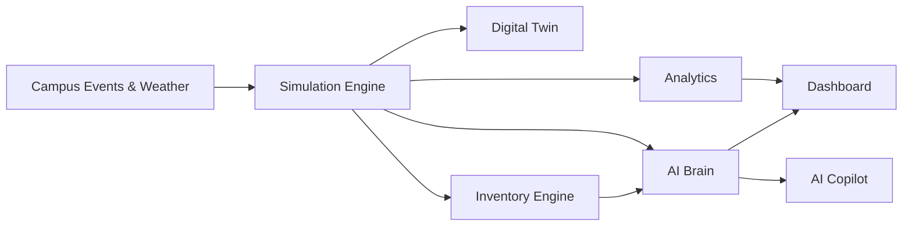

<div align="center">

# ☕ BrewMind AI

### 🧠 Real-Time Intelligence for Coffee Shop Operations

Transform coffee shop operations into intelligent, data-driven decisions using **Artificial Intelligence, Digital Twins, Predictive Analytics, and Real-Time Simulation.**

<p align="center">

[](https://6a45716447b4450008620265--astounding-jalebi-a9cf7e.netlify.app/)
[]()
[]
[]
[]
[]
[]

</p>

### 🌐 Live Demo

## **https://6a45716447b4450008620265--astounding-jalebi-a9cf7e.netlify.app/**

</div>

---

# ☕ Overview

Every day, coffee shop managers make dozens of operational decisions.

- Should inventory be restocked now?
- Why is the queue suddenly increasing?
- Which employee is overloaded?
- Will today's ingredients last through the evening rush?
- How will weather affect customer traffic?
- What happens if one coffee machine breaks?

Most cafés rely on experience and intuition.

**BrewMind AI** transforms those decisions into **real-time, AI-assisted intelligence.**

It combines an interactive **Digital Twin**, a **live simulation engine**, **predictive analytics**, and an **AI Operations Copilot** to help managers monitor, predict, and optimize every aspect of café operations before problems impact customers.

---

# 🚀 Live Features

## 📊 Operations Dashboard

Monitor every important business metric in real time.

- 💰 Revenue
- 👥 Active Customers
- ⏳ Queue Length
- ⌛ Average Wait Time
- 📦 Inventory Health
- ⚙ Machine Health
- 😊 Customer Satisfaction
- ⭐ Café Reputation
- 👨‍🍳 Staff Efficiency
- 🤖 AI Confidence

---

## 🏪 Interactive Digital Twin

Watch the café operate live.

Features include:

- Animated customers
- Dynamic queue movement
- Barista workflows
- Machine activity
- Seating utilization
- Weather effects
- Live operational status
- Real-time updates

---

## 🤖 AI Operations Copilot

Ask BrewMind AI questions like

- What should I restock?
- Why is revenue dropping?
- Which employee needs help?
- What should I prepare before lunch rush?
- How can I reduce wait time?
- What happens if demand suddenly spikes?

Supported AI Providers

- Gemini API
- OpenAI Compatible APIs
- Ollama
- LM Studio
- Built-in Offline AI Reasoning

---

## 📦 Smart Inventory System

Monitor

- Ingredient availability
- Supplier quality
- Purchase orders
- Restocking suggestions
- Freshness tracking
- Waste prediction
- Consumption forecasting

---

## 📈 Analytics Dashboard

Interactive charts powered by Chart.js

- Revenue Trends
- Queue Analytics
- Customer Satisfaction
- Machine Health
- Inventory Usage
- Weather Impact
- Product Performance
- Forecasting

---

## 🎮 Scenario Sandbox

Simulate operational events before they happen.

Examples

- 🌧 Rainy Day
- 🎓 Exam Week
- 🎉 Festival Rush
- ⚠ Machine Failure
- 👨‍🍳 Staff Shortage
- 🚚 Inventory Crisis

See how every KPI changes instantly.

---

## 🧠 Intelligent Simulation Engine

The application continuously simulates

- Customer arrivals
- Queue growth
- Order generation
- Recipe preparation
- Ingredient consumption
- Employee workload
- Inventory depletion
- Machine wear
- Customer satisfaction
- Revenue generation
- AI recommendations

Everything updates in real time.

---

# ⚙ System Workflow

```text
Campus Schedule
        │
        ▼
Customer Simulation
        │
        ▼
Order Processing
        │
        ▼
Inventory Engine
        │
        ▼
Digital Twin
        │
        ▼
AI Operations Brain
        │
        ▼
Dashboard
Analytics
Recommendations
Copilot
```

---

# 🏗 Architecture



---

# ✨ Highlights

✅ AI Operations Copilot

✅ Live Digital Twin

✅ Smart Inventory

✅ Predictive Analytics

✅ Interactive Scenario Simulator

✅ Weather-Aware Demand Prediction

✅ Real-Time KPI Dashboard

✅ Customer Simulation Engine

✅ Persistent Local Memory

✅ Interactive Charts

✅ Fully Browser-Based

✅ No Backend Required

---

# 🛠 Technology Stack

| Category | Technologies |
|------------|-------------|
| Frontend | HTML5, CSS3 |
| Language | Vanilla JavaScript (ES Modules) |
| Animation | GSAP |
| Charts | Chart.js |
| Icons | Lucide Icons |
| Weather | Open-Meteo API |
| AI | Gemini API |
| AI Compatible | OpenAI Compatible APIs |
| Local AI | Ollama, LM Studio |
| Storage | Browser localStorage |
| Voice | Web Speech API |
| Audio | Web Audio API |
| Graphics | SVG, Canvas |
| Deployment | Netlify |

---

# 📂 Project Structure

```
.
│
├── index.html
├── style.css
├── isometric_cafe_bg.png
│
└── js
    ├── analytics.js
    ├── app.js
    ├── brain.js
    ├── copilot.js
    ├── demo.js
    ├── inventory.js
    ├── memory.js
    ├── scenarios.js
    ├── simulation.js
    ├── twin.js
    └── utils.js
```

---

# 🚀 Getting Started

## Clone Repository

```bash
git clone https://github.com/samvit-srivastava/BrewMind-AI.git
```

Move into the project

```bash
cd BrewMind-AI
```

---

## Run with VS Code Live Server

Right click

```
index.html
```

Choose

```
Open with Live Server
```

---

## Or Using Python

```bash
python -m http.server
```

Visit

```
http://localhost:8000
```

---

# 🎯 Demo Flow

Recommended 2–3 minute demonstration

1. Splash Animation
2. Dashboard Overview
3. Digital Twin
4. Trigger Morning Rush
5. Machine Failure Scenario
6. Inventory Dashboard
7. Analytics Dashboard
8. AI Copilot
9. Scenario Sandbox
10. Final Business Insights

---

# 💡 Why BrewMind AI?

Traditional dashboards only display information.

**BrewMind AI understands it.**

Instead of showing numbers, it answers questions like

- What should I do next?
- Why is this happening?
- What will happen in the next hour?
- Which action improves operations the most?

It transforms reactive management into predictive decision-making.

---

# 🏆 BeanHacks 2026

BrewMind AI was built for **BeanHacks 2026**.

It addresses multiple challenge areas including

- ☕ Coffee Shop Operations
- 📦 Inventory Optimization
- 👨‍🍳 Staff Management
- 📊 Sales Analytics
- 😊 Customer Experience
- 🤖 Artificial Intelligence
- 📈 Business Intelligence
- 🔮 Predictive Operations

---

# 🛣 Future Roadmap

- 📱 Mobile Application
- ☁ Cloud Synchronization
- 🏪 Multi-Store Management
- 📷 Computer Vision Queue Detection
- 🤖 Autonomous AI Manager
- 📊 POS Integration
- ☕ IoT Coffee Machine Integration
- 📈 Advanced Demand Forecasting
- 🌍 Multi-Language Support

---

# 👨‍💻 Developer

**Samvit Srivastava**

GitHub

https://github.com/samvit-srivastava/BrewMind-AI

---

# 📄 License

This project was developed as a **Hackathon Prototype** for **BeanHacks 2026**.

---

<div align="center">

## ☕ Brew Smarter. Predict Better. Serve Faster.

### Built with ❤️ using HTML, CSS, JavaScript, AI, and a passion for building intelligent systems.

⭐ If you enjoyed this project, consider giving it a star!

</div>
